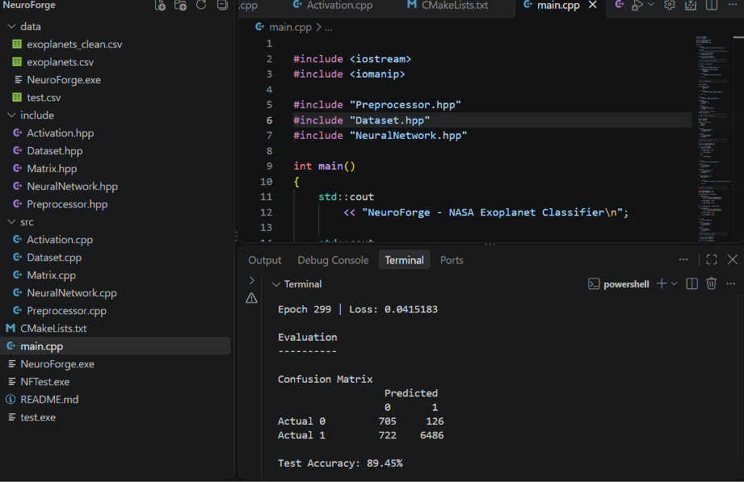

# NeuroForge

### A neural network built from scratch in C++17 and applied to NASA exoplanet data

**NeuroForge** is a small feed-forward neural network implemented from scratch in **C++17 using only the Standard Library**. It was built to understand what happens underneath machine-learning frameworks: matrix operations, forward propagation, backpropagation, gradient descent, data preprocessing, class-weighted training, and evaluation metrics are all written by hand.

It is applied to a real dataset from the **NASA Exoplanet Archive** as a learning and engineering experiment.

> **Status:** educational project. The results below come from a single, unseeded run and have known limitations (see [Known Limitations](#known-limitations)). They are not a scientific claim about exoplanet discovery.

---

## The Experiment

**Question:** can a small neural network learn to tell planets discovered by the *Transit* method from planets discovered by any other method, using planetary and stellar properties?

### Data

- Source: NASA Exoplanet Archive (operated by NExScI), publicly available.
- Processed file included in this repo: `data/exoplanets_clean.csv`
  - 40,194 rows, 9 numerical features, 1 binary label
  - 36,100 rows are `Transit` (≈ 89.8%), 4,094 are non-transit (≈ 10.2%)
- The raw archive export (`data/exoplanets.csv`) is **not** included because of file size.

**Label:**

```text
Transit                    → 1
Any other discovery method → 0
```

**Features:**

| Feature       | Description                     |
| ------------- | ------------------------------- |
| `pl_orbper`   | Planet orbital period           |
| `pl_orbsmax`  | Planet orbital semi-major axis  |
| `pl_orbeccen` | Planet orbital eccentricity     |
| `pl_eqt`      | Planet equilibrium temperature  |
| `pl_rade`     | Planet radius                   |
| `st_teff`     | Host-star effective temperature |
| `st_mass`     | Host-star mass                  |
| `st_rad`      | Host-star radius                |
| `st_met`      | Host-star metallicity           |

---

## Pipeline

```text
Raw NASA CSV  (data/exoplanets.csv)
      ↓
Feature selection + label creation
      ↓
Median imputation of missing values
      ↓
Clean CSV  (data/exoplanets_clean.csv)
      ↓
Min-max normalization
      ↓
Random 80/20 train/test split
      ↓
Class-weighted training
      ↓
Evaluation on the test set
```

- **Median imputation:** missing values are replaced by the median of that feature (less sensitive to outliers than the mean).
- **Normalization:** min-max scaling to [0, 1], `x' = (x - min) / (max - min)`.
- **Class weighting:** the error of the minority class is multiplied by `majority_count / minority_count`, capped at 20. With the training split used here, non-transit samples receive a weight of roughly 9 and transit samples a weight of 1.

---

## Network

```text
9 inputs → 8 hidden neurons (sigmoid) → 1 output neuron (sigmoid) → transit probability
```

| Parameter            | Value                                   |
| -------------------- | --------------------------------------- |
| Input neurons        | 9                                       |
| Hidden neurons       | 8                                       |
| Output neurons       | 1                                       |
| Hidden activation    | Sigmoid                                 |
| Output activation    | Sigmoid                                 |
| Weight init          | Uniform in [-1, 1]                      |
| Loss                 | Squared error                           |
| Optimizer            | Per-sample (stochastic) gradient descent |
| Learning rate        | 0.01                                    |
| Epochs               | 300                                     |
| Decision threshold   | 0.5                                     |
| Train / test split   | 80% / 20% (32,155 / 8,039 samples)      |

ReLU and its derivative are implemented in `Activation.cpp` but are not used by the final network.

---

## Mathematics

**Forward pass**

$$
z_h = W_h x + b_h, \qquad a_h = \sigma(z_h), \qquad \sigma(x) = \frac{1}{1 + e^{-x}}
$$

$$
z_o = W_o a_h + b_o, \qquad \hat{y} = \sigma(z_o)
$$

**Loss** (per sample, scaled by the class weight $w$):

$$
L = \frac{1}{2}(\hat{y} - y)^2, \qquad L_w = w \cdot L
$$

**Backpropagation**

$$
\delta_o = w\,(\hat{y} - y)\,\sigma'(z_o)
$$

$$
\delta_h = (W_o^{\top}\delta_o) \odot \sigma'(z_h)
$$

where $\odot$ is element-wise multiplication. The hidden-layer error uses the output weights from *before* they are updated.

**Parameter update** (applied after every single training sample):

$$
W \leftarrow W - \eta \nabla W, \qquad b \leftarrow b - \eta \nabla b
$$

---

## Results

Single run: trained on 32,155 samples, tested on 8,039.

| Metric            | Result |
| ----------------- | -----: |
| Accuracy          | 89.45% |
| Balanced accuracy | 87.41% |
| Precision         |   0.98 |
| Recall            |   0.90 |
| Specificity       | 84.8%  |

**Confusion matrix (test set):**

```text
                  Predicted
                  0       1
Actual 0        705     126
Actual 1        722    6486
```

**Important context:** the test set is about 89.7% transit (7,208 of 8,039). A model that always predicts "Transit" would therefore score ≈ 89.7% accuracy, which is *higher* than the 89.45% above. Plain accuracy does not show that the network learned something. **Balanced accuracy (87.4%) and specificity (84.8%) are the more informative numbers**, because the always-Transit baseline would score only 50% balanced accuracy and 0% specificity.

**Training loss** (mean squared-error loss reported by the program):

```text
Epoch   0 → 0.119837
Epoch  25 → 0.0574817
Epoch  50 → 0.0478365
Epoch 100 → 0.0430867
Epoch 150 → 0.0420875
Epoch 200 → 0.0418468
Epoch 250 → 0.0416575
Epoch 299 → 0.0415183
```



Weight initialization and the train/test split are not seeded, so metrics will differ slightly from run to run.

---

## Known Limitations

- **Possible duplicate leakage.** The processed CSV contains 7,406 rows (≈ 18%) whose nine feature values exactly match another row. The NASA table can list the same planet more than once, so copies of the same planet can land in both the training and test sets and make results look better than they are.
- **Preprocessing before the split.** Median imputation and min-max normalization are computed on the full dataset before the train/test split, so test-set statistics influence the scaling.
- **Trivial-baseline comparison.** As explained above, accuracy is not better than always predicting the majority class; the model's value shows up in balanced accuracy and specificity.
- **Not seeded.** Results are not exactly reproducible.
- **Method-driven features.** Discovery method correlates with features like orbital period, planet radius, and host-star properties because each detection technique is biased toward certain planets. The model may be learning *which planets each method can detect* as much as anything about the planets themselves.
- **Simple model and setup.** Small architecture, squared-error loss with sigmoid output, no mini-batches, no advanced optimizer (e.g. Adam), no hyperparameter search, no cross-validation, and no comparison against conventional ML models.
- **Binary simplification.** All non-transit discovery methods are merged into one class.

---

## Project Structure

```text
NeuroForge/
├── include/
│   ├── Activation.hpp
│   ├── Dataset.hpp
│   ├── Matrix.hpp
│   ├── NeuralNetwork.hpp
│   └── Preprocessor.hpp
├── src/
│   ├── Activation.cpp
│   ├── Dataset.cpp
│   ├── Matrix.cpp
│   ├── NeuralNetwork.cpp
│   └── Preprocessor.cpp
├── data/
│   ├── exoplanets_clean.csv
│   └── test.csv
├── main.cpp
├── CMakeLists.txt     (currently empty; build with g++ as shown below)
├── Screenshot.png
└── README.md
```

---

## Building and Running

**Requirements:** a C++17 compiler (e.g. g++).

```bash
git clone https://github.com/amnafatimaa6-ops/-NeuroForge.git NeuroForge
cd NeuroForge
g++ -std=c++17 main.cpp src/*.cpp -Iinclude -o NeuroForge
```

**Data requirement:** `main.cpp` first runs the preprocessing step on the raw file `data/exoplanets.csv`, which is not included in this repository. Running `./NeuroForge` without it prints `ERROR: Preprocessing failed.` and exits. To run the experiment you can either:

1. Download the planetary-systems table from the [NASA Exoplanet Archive](https://exoplanetarchive.ipac.caltech.edu/), save it as `data/exoplanets.csv`, then run `./NeuroForge`; or
2. Skip Step 1 in `main.cpp` (the `Preprocessor` block) so the program loads the included `data/exoplanets_clean.csv` directly.

```bash
./NeuroForge          # Linux / macOS
NeuroForge.exe        # Windows
```

---

## What Is Implemented From Scratch

- **Matrix library:** multiplication, addition, subtraction
- **Neural network:** sigmoid / ReLU activations and derivatives, forward propagation, backpropagation, weight and bias updates, class-weighted training
- **Data handling:** CSV parsing, feature extraction, missing-value detection, median imputation, min-max normalization, random train/test split, binary label creation
- **Evaluation:** confusion matrix, accuracy, precision, recall, specificity, balanced accuracy

No TensorFlow, PyTorch, Eigen, or other ML library is used.

---

## Future Work

- Remove duplicate planets before splitting; split first, then fit imputation and normalization on the training set only
- Fixed random seeds for reproducibility
- Binary cross-entropy loss, better weight initialization (Xavier/He), mini-batch training, Adam
- ROC-AUC and precision-recall analysis; cross-validation
- Comparison with logistic regression and a random forest
- A working `CMakeLists.txt`
- Larger astronomical datasets; multi-class discovery-method prediction

---

## Author

**Amna Fatima**, student interested in artificial intelligence, machine learning, scientific computing, astronomy, and computational physics.

---

## License and Data Attribution

Code is released under the license in this repository (`LICENSE`). The astronomical data originates from the **NASA Exoplanet Archive** and remains subject to its data policies and attribution requirements.
